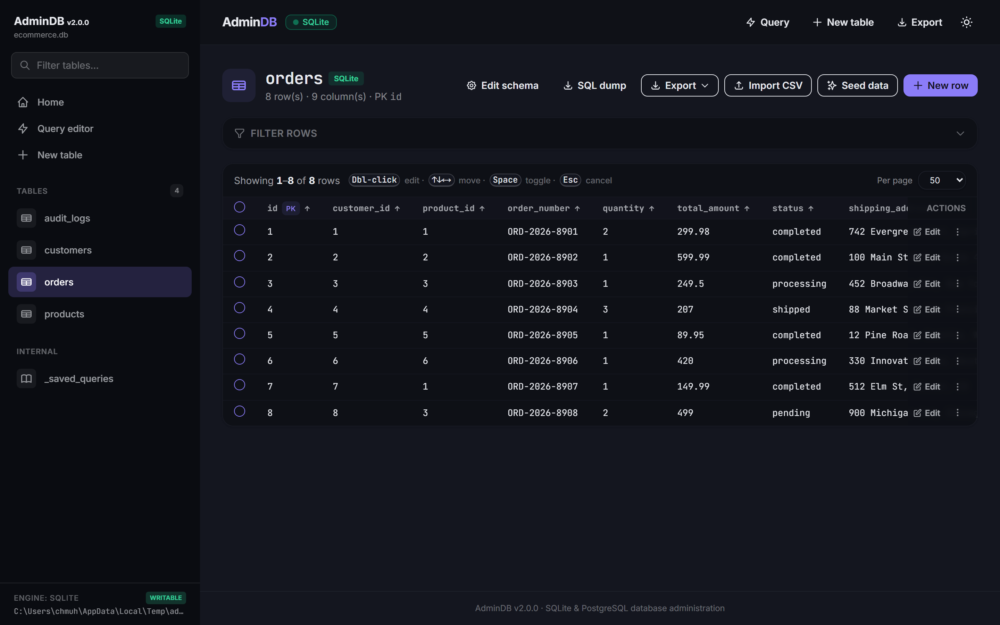
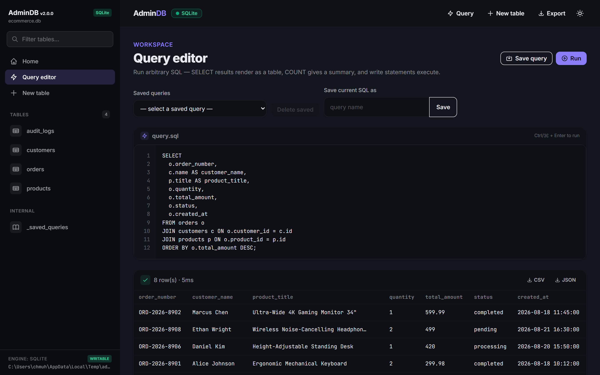
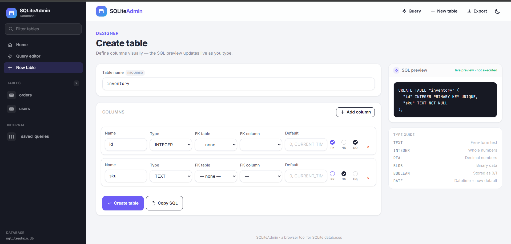
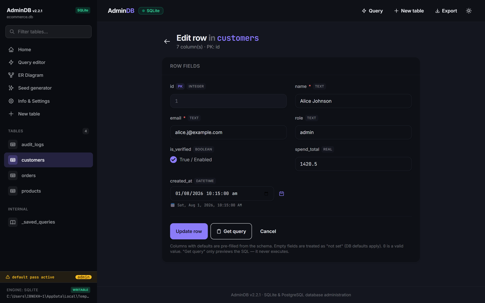
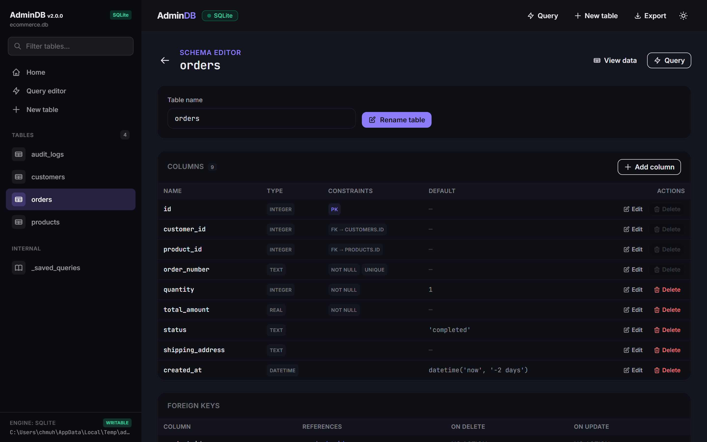
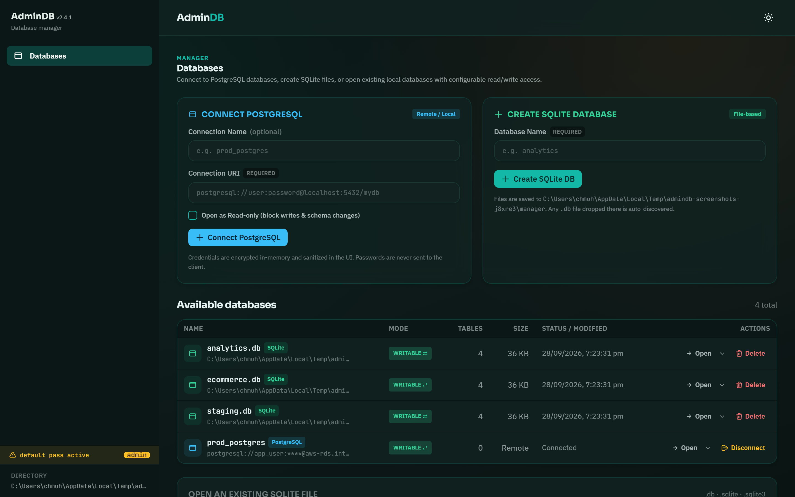

# AdminDB


[](https://www.npmjs.com/package/admindb)
[](LICENSE)
[](https://nodejs.org/)
[](https://github.com/MIbnEKhalid/admindb/actions/workflows/publish.yml)
[](https://www.npmjs.com/package/admindb)


A browser-based SQLite database administration tool. Manage a SQLite database
entirely from the browser: browse tables with full CRUD, inline
spreadsheet-style grid editing, type-aware filters, bulk row operations, a
visual table designer, an arbitrary SQL query runner, saved named queries,
SQL-dump export, a "generate SQL" preview mode that never executes, a schema
editor, and multi-database support.

- **Backend:** Node.js + TypeScript (compiled to plain JS) on Express.
- **Frontend:** Handlebars server-rendered templates, Tailwind CSS + DaisyUI,
  plain JavaScript (no frontend framework).
- **Database:** SQLite via [better-sqlite3](https://github.com/WiseLibs/better-sqlite3). Requires
  **Node.js ≥ 20**.

> ## ⚠️ Security warning — read first
>
> **This tool exposes full, unauthenticated database AND filesystem access.**
> Every page and API route (browse, edit, delete, run arbitrary SQL, change the
> schema, export the whole database, and — in manager mode — browse the
> filesystem to open database files) is available to **anyone who can reach the
> server**.
>
> - **No authentication or authorization is built in.** The routes are **not
>   protected**.
> - **It is your responsibility to protect access.** Do **not** expose
>   AdminDB to the public internet or to untrusted networks.
> - Recommended ways to protect it:
>   - bind the standalone server to `127.0.0.1` (`HOST=127.0.0.1`) and use it
>     only from your own machine, and/or
>   - run it behind a reverse proxy that requires authentication (Basic auth,
>     OAuth, mTLS, …) or inside a VPN / private network.
>
> Treat AdminDB as if it were a remote `sqlite3` shell with write access.

---

## Install

```bash
npm install admindb
```

Requires **Node.js ≥ 20**.

### Use as a standalone CLI tool

AdminDB ships a command-line server. Install it globally (or just run it with
`npx` — no install needed):

```bash
npm install -g admindb
admindb                    # starts the server → open http://localhost:3000
```

Run it without installing anything:

```bash
npx admindb -p 8080        # run on port 8080
```

The `admindb` command starts the built-in server and opens the web UI in your
browser. See [Run the built-in server](#run-the-built-in-server) for all the
flags — `--port`, `--open <file>`, `--dir <folder>`, `--readonly`, and more.

## Using as an npm package

AdminDB is an Express app you can mount inside your own application, under
your own path, on the same port as the rest of your server.

### Minimal example

```ts
import express from 'express';
import { createRouter } from 'admindb';

const app = express();

app.get('/', (_req, res) => res.send('My main app'));

// All AdminDB routes live under /admin on the same port.
app.use('/admin', createRouter({ dbPath: '/data/my.db', basePath: '/admin' }));

app.listen(3000);
```

`createRouter(options)` returns a fully wired Express app (pages + JSON API +
static assets + view engine). Mounting it is just `app.use('/path', router)`.

### Options

| Option     | Type                 | Description                                                    |
| ---------- | -------------------- | -------------------------------------------------------------- |
| `dbPath`   | `string`             | Path to a single SQLite file (single-db mode). Default: `admindb.db` |
| `db`       | `SqliteDatabase`     | An already-open database instance (advanced embedding)         |
| `manager`  | `DbManager`          | Enables multi-database mode (see below)                        |
| `basePath` | `string`             | URL prefix used by templates/assets (e.g. `/admin`). Pass the same prefix you mount at |
| `logger`   | `Logger`             | Custom logger (see `createLogger`)                             |
| `logLevel` | `'debug'\|'info'\|'warn'\|'error'` | Log verbosity (used when no logger is passed)     |
| `allowBrowse` | `boolean`         | Manager mode: show the filesystem file-browser on the databases page. Set `false` to disable it (e.g. when the server was started with specific database files). Default: `true` |
| `browseRoot` | `string`          | Manager mode: restrict the file-browser to this folder (absolute path) — it cannot navigate above it and only databases inside it can be opened |
| `readonly` | `boolean`            | Open the database(s) **read-only**: every write is rejected (403), write controls are disabled in the UI, and a banner is shown. The DB file is opened with `SQLITE_OPEN_READONLY` + `PRAGMA query_only` as a belt-and-suspenders guard. Default: `false` |

Example with a custom logger and prefix:

```ts
import express from 'express';
import { createRouter, createLogger } from 'admindb';

const app = express();
app.use('/tools/db', createRouter({
  dbPath: './data/app.db',
  basePath: '/tools/db',
  logLevel: 'info',
}));
app.listen(3000);
```

### Multiple databases

Pass a `DbManager` to manage several database files — either from a directory,
from an explicit list of file paths, or both:

```ts
import express from 'express';
import { createRouter, DbManager, createLogger } from 'admindb';

const app = express();
app.use('/admin', createRouter({
  manager: new DbManager(
    {
      dir: './data',                                  // scan a directory
      files: ['/srv/legacy/app.db', './shared.sqlite'], // and/or explicit paths
      readonly: true,                                 // open all databases read-only
    },
    createLogger('info'),
  ),
  basePath: '/admin',
}));
```

In multi-db mode:

- a **"Databases" landing page** lets you open, create, and delete database files,
- every database is scoped under its file name, e.g.
  `/admin/app.db/tables/users` and `/admin/app.db/api/tables`,
- file names that collide across sources are deduped (`name__2.db`).

## Features

- Browse every table and its rows (paginated, with primary-key awareness).
- **Filter rows by column** — type-aware, per-column filter controls: foreign-key
  dropdowns, boolean toggles, date and numeric range inputs, plus the exact
  (`=value`), comparison (`>5`, `<=10`), prefix (`pre*`) and substring (plain
  text) operators on text columns. Filters survive sorting and pagination.
- **Inline (spreadsheet-style) editing** — double-click any cell to edit it in
  place with a type-aware control (FK dropdown, boolean toggle, date picker,
  number/text input). Changes are staged and highlighted in the grid, then
  applied all at once in a single transaction, or discarded.
- Insert and delete rows (full CRUD). FK columns become dropdowns.
- **Bulk row operations** — select rows with checkboxes (or "select all"), then
  **delete** them in one transaction (with a warning listing how many rows in
  other tables reference them) or **export** only the selected rows as CSV/JSON.
- **Export** table rows or query results as **CSV or JSON**, and **import a CSV
  file** (or pasted CSV) into a table.
- Create tables visually: name, type, primary key, not-null / unique,
  default value, and foreign-key references.
- Write and run arbitrary SQL — SELECTs render as a table, `COUNT` queries show
  a readable summary, write statements execute and report affected rows.
- Save named queries and reload them from a dropdown.
- Export the whole database as a downloadable SQL dump (`CREATE` + `INSERT`).
- **Get query / preview mode:** generate `CREATE` / `INSERT` / `UPDATE` SQL from
  the UI without executing it.
- **Edit schema:** rename the table, add / rename / drop columns (with
  relationship-safety checks), and drop tables.
- **Indexes:** create indexes (plain or unique, on one or many columns — pick
  columns in order, with a live `CREATE INDEX` SQL preview) and drop them from
  the schema editor; automatic SQLite indexes are protected.
- **Related rows:** every table that has a foreign key pointing at a table gets
  its own column at the end of that table's grid — each cell shows how many of
  its rows reference that record; click it to open a nested table with all of
  the referencing table's columns and data for that specific record.
- **Read-only mode:** open the database(s) without write access — the file is
  opened `SQLITE_OPEN_READONLY` + `query_only`, every write route returns `403`,
  and the UI hides/disables all write controls and shows a banner.
- **Standalone CLI / file browser:** `admindb` runs as a full web app — with no
  arguments it opens a **Databases** landing page where you can browse the
  filesystem and open any SQLite database file, or create new ones. Flags set
  the port, open a file, manage a folder, and more (`admindb --help`).
- **Multiple databases:** directory scanning and/or explicit file lists, each
  with its own workspace under `/{db}/…`.

## Screenshots

Home dashboard — stat cards and the table list.


Table browser — sortable columns, sticky header, and per-row actions.



Query editor — line-numbered editor with a results table.



Table designer — visual columns with a live SQL preview.



Insert / edit form — column defaults are pre-filled.



Schema editor — rename the table, add / rename / drop columns safely.



Databases landing page (multi-db mode) — manage multiple SQLite files.



## Run the built-in server

For convenience a standalone server is included. From a clone of the repo:

```bash
npm install
npm run build
npm start        # open http://localhost:3000
```

The server is a full standalone web app. With no arguments it runs in
**manager mode**: a **Databases** landing page where you can browse the
filesystem and open any SQLite database file (`.db` / `.sqlite` / `.sqlite3`),
or create new ones.

### CLI flags

| Flag                 | Description                                              |
| -------------------- | -------------------------------------------------------- |
| `-p, --port <port>`  | Port to listen on (default `3000`)                       |
| `-H, --host <host>`  | Host / interface to bind (default `0.0.0.0`)             |
| `-o, --open <file>`  | Open a single database file directly                     |
| `-d, --dir <dir>`    | Manage a folder of database files                        |
| `--files <list>`     | Comma-separated database file paths to manage            |
| `-b, --base-path <p>`| URL prefix to serve under (default `/`)                  |
| `-r, --readonly`     | Open databases read-only (all writes disabled)           |
| `-l, --log-level <l>`| `debug` \| `info` \| `warn` \| `error` (default `info`)  |
| `-h, --help`         | Show help                                               |
| `-v, --version`      | Show the version                                         |

A positional `path` argument opens a database file directly, or manages a
folder when it is a directory. Flags override the environment variables below:

| Variable    | Default | Description                          |
| ----------- | ------- | ------------------------------------ |
| `PORT`      | `3000`  | Port to listen on                    |
| `HOST`      | `0.0.0.0` | Host / interface to bind           |
| `DB_PATH`   | —       | Single SQLite database file          |
| `DB_DIR`    | —       | Folder of `.db`/`.sqlite` files      |
| `DB_FILES`  | —       | Comma-separated explicit database file paths |
| `READONLY`  | —       | `1` / `true` / `yes` / `on` opens the database(s) read-only |
| `BASE_PATH` | `''`    | URL prefix (e.g. `/admin`)           |
| `LOG_LEVEL` | `info`  | `debug` \| `info` \| `warn` \| `error` |

Examples:

```bash
admindb                        # manager UI on http://localhost:3000
admindb -p 8080                # same, on port 8080
admindb ./data/app.db          # open a single database file
admindb --open ~/notes.sqlite  # open a file directly
admindb -d ./dbs               # manage a folder of databases
admindb --files a.db,b.db -r   # open two files read-only
```

```powershell
$env:DB_DIR='./db'; npm start   # PowerShell
# bash/zsh:  DB_DIR=./db npm start
```

When the server runs without an explicit single file, the **Databases** landing
page lists the managed databases and includes an **"Open an existing
database"** file browser: navigate folders, pick a database file, and open it.
Opened files are added to the list so you can switch between databases freely.

File-browser policy:
- When a **folder** is given (`--dir`, a directory path, or `DB_DIR`), browsing
  is limited to that folder — it cannot navigate above it and only databases
  inside it can be opened.
- When specific **files** are given (`--files`, or `DB_FILES`) without a folder,
  file browsing is **disabled** entirely; only the configured databases are
  listed.
- With no folder or files, browsing is unrestricted.

## The JSON REST API (under `basePath`)

| Method | Path                                     | Purpose                          |
| ------ | ---------------------------------------- | -------------------------------- |
| GET    | `/api/tables`                            | List tables                      |
| GET    | `/api/tables/:table/info`                | Column + FK metadata, PK columns |
| GET    | `/api/tables/:table/fk-options`          | Values for FK dropdowns          |
| GET    | `/api/tables/:table/rows?page&limit&f`   | Paginated rows (`f` = URL-encoded JSON filters — legacy strings like `{"age":">35"}` or structured conditions like `{"balance":{"op":"gte","value":"100"}}`) |
| GET    | `/api/tables/:table/row/:id`             | Single row by (encoded) PK       |
| POST   | `/api/tables/:table/rows`                | Insert row                       |
| POST   | `/api/tables/:table/rows/generate`       | Generate INSERT SQL (no execute) |
| POST   | `/api/tables/:table/rows/import`         | Import CSV (`{ csv }`, header row must match columns) |
| GET    | `/api/tables/:table/export?format=`      | Download all rows as `csv` or `json` |
| PUT    | `/api/tables/:table/row/:id`             | Update row (`{ values, nulls? }` — `nulls` explicitly sets columns to NULL) |
| PUT    | `/api/tables/:table/row/:id/generate`    | Generate UPDATE SQL (no execute) |
| DELETE | `/api/tables/:table/row/:id`             | Delete row                       |
| POST   | `/api/tables/:table/rows/bulk-impact`    | FK-impact preview: how many rows in other tables reference the selected rows |
| POST   | `/api/tables/:table/rows/bulk-delete`    | Delete selected rows (`{ ids, confirmImpact }`; transactional) |
| POST   | `/api/tables/:table/rows/bulk-export`    | Export only the selected rows as `csv`/`json` (`{ ids, format }`) |
| POST   | `/api/tables/:table/rows/bulk-update`    | Apply staged inline edits (`{ updates: [{ id, values?, nulls? }] }`; transactional) |
| POST   | `/api/tables`                            | Create table                     |
| POST   | `/api/tables/generate`                   | Generate CREATE SQL (no execute) |
| GET    | `/api/tables/:table/schema`              | Full schema (constraints, indexes, FK refs) |
| POST   | `/api/tables/:table/rename`              | Rename the table                 |
| POST   | `/api/tables/:table/columns`             | Add a column                     |
| PUT    | `/api/tables/:table/columns/:column`     | Rename a column                  |
| DELETE | `/api/tables/:table/columns/:column`     | Drop a column (safety-checked)   |
| DELETE | `/api/tables/:table`                     | Drop the table (safety-checked)  |
| POST   | `/api/tables/:table/indexes`             | Create an index (`{ name?, columns[], unique? }`) |
| DELETE | `/api/tables/:table/indexes/:index`      | Drop an index (auto indexes refused) |
| POST   | `/api/query`                             | Run arbitrary SQL                |
| POST   | `/api/query/export`                      | Run a SELECT and download as `csv`/`json` |
| GET    | `/api/queries`                           | List saved queries               |
| POST   | `/api/queries`                           | Save a named query               |
| DELETE | `/api/queries/:id`                       | Delete a saved query             |

In multi-db mode, every route is scoped under the database, e.g.
`/api/app.db/tables`. Every API response uses the consistent shape
`{ success, data?, error? }`.

In manager mode (the databases landing page), these extra endpoints manage
database files and power the filesystem browser:

| Method | Path                    | Purpose                                     |
| ------ | ----------------------- | ------------------------------------------- |
| GET    | `/api/databases`        | List managed databases                      |
| POST   | `/api/databases`        | Create a new database (`{ name }`)          |
| DELETE | `/api/databases/:id`    | Delete a database                           |
| GET    | `/api/fs/list?path=`    | List subfolders + SQLite files under a path (file browser) |
| POST   | `/api/databases/open`   | Open/register an existing database file by path (`{ path }`) |

## Behaviour notes

- **Empty input = "not set".** Empty form fields are omitted so DB defaults
  apply; `0` is a valid value and is never treated as empty.
- **Insert forms pre-fill defaults.** On the "new row" form, columns that have
  a schema default are pre-filled (string/number/boolean literals and
  `CURRENT_TIMESTAMP`-style defaults) so you can see and adjust them.
- **Row filters.** The filter panel adapts to each column's type: foreign keys
  become dropdowns (with a "not set / NULL" option), booleans become
  any/true/false toggles, and dates and numbers become min/max range inputs.
  Text columns keep the operator syntax: exact match (`=value`), comparison
  (`>5`, `>=5`, `<5`, `<=5`, `!=value`), prefix (`pre*`) and case-insensitive
  substring (plain text). Filters are carried in the URL (as legacy strings or
  structured conditions) and survive sorting and pagination.
- **Inline editing is staged, not instant.** Double-click a cell to edit it in
  place; edits are buffered locally and highlighted in the grid rather than
  written immediately. Press **Apply** to write every pending change to the
  database in a single transaction (the page then reloads so related-row counts
  stay accurate), or **Discard** to revert everything back to the saved values.
  Clearing a text/date/number field stages a `NULL`.
- **Bulk operations.** Checkboxes select rows on the current page; "select all"
  checks every visible row. **Delete** first shows a warning listing each table
  that references the selected rows and how many rows point at them (these may
  be cascaded away or orphaned depending on the foreign-key action, and the
  delete can fail if a constraint blocks it). **Export CSV / JSON** downloads
  only the selected rows. Both delete and export are capped at 1000 rows per
  batch.
- **CSV import.** The first row must be a header whose names match existing
  columns (unknown or duplicate names are rejected). Empty cells are treated as
  "not set" so database defaults apply. The whole import runs in a single
  transaction — a failed row rolls everything back.
- **Indexes.** Creating an index takes one or more columns and an optional
  unique flag (the index name is optional too). Only explicitly created indexes
  (`origin = 'c'`) can be dropped from the UI — automatic primary-key/unique
  indexes are protected.
- **Schema editor.** Drops are refused when the column is a primary key, has a
  UNIQUE constraint, is used by an index, is part of a foreign key, or is
  referenced by another table's foreign key. Tables referenced by other tables
  cannot be dropped. Internal (`_`-prefixed) tables cannot be renamed or dropped.
- **Identifiers are quoted and string values escaped** everywhere SQL is built,
  so generated SQL is correct and safe.
- **`COUNT` queries** return a readable summary message instead of a table.
- **"Get query" never executes** — it only returns the generated SQL string.
- **Internal table** `_saved_queries` stores saved queries and is kept out of
  user-facing FK pickers. Schema initialization is idempotent and safe to run
  repeatedly.
- Composite primary keys are supported (values are URL-encoded and comma-joined
  in the row endpoints).

## Development

```bash
npm install
npm run build      # TypeScript → dist + Tailwind CSS
npm run dev        # tsx watch server + Tailwind watch
npm test           # builds and runs the unit tests
```

`npm test` compiles TypeScript to `dist/` and runs the `node:test` suite
covering the SQL generator (INSERT / UPDATE / CREATE output, type mapping,
quoting, rejection of unsupported types), the SQL classifier, CSV parsing and
serialization, row filters (legacy and structured conditions), the database
layer (pagination, transactions, bulk update/delete, read-only enforcement),
and the database manager.

## Publishing to npm

The package ships the compiled `dist/` (with type declarations), this `README`,
and the `LICENSE`. When you are ready to publish:

```bash
npm run build     # happens automatically via the prepack script
npm login
npm publish
```

Update `name`/`version` in `package.json` to match your intended package name
and add an `author`/`repository` if desired.

## License

[MIT](./LICENSE) — see the [LICENSE](LICENSE) file.
