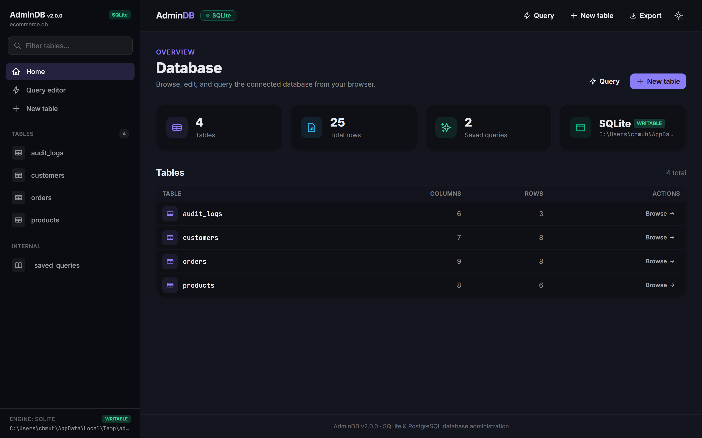

# AdminDB

[](https://www.npmjs.com/package/admindb)
[](LICENSE)
[](https://nodejs.org/)
[](https://www.npmjs.com/package/admindb)
[](https://github.com/MIbnEKhalid/admindb/actions/workflows/publish.yml)

**A modern, browser-based SQLite database administration tool.** Manage SQLite databases entirely from your browser — browse and edit rows, run arbitrary SQL queries, design schemas visually, seed realistic test data, and import/export CSV/JSON — with no separate frontend app to build or deploy.

- **Zero frontend build step:** Server-rendered Handlebars UI + vanilla JS + Tailwind/DaisyUI; a single lightweight Express process serves pages, static assets, and the REST API.
- **Standalone CLI or embeddable library:** Run instantly via `npx admindb` or mount it directly into your existing Express application under any subpath.
- **Modern terminal experience:** Clean, colorized startup banner with auto-detected local/network URLs and streamlined runtime logs.
- **Safe SQL by construction:** Quoted identifiers, escaped literals, parameterized queries, and non-executing SQL preview modes.

---



> 📸 **Visual Tour:** See [`docs/screenshots/`](docs/screenshots/) for screenshots of the Table Browser, Query Editor, Visual Schema Designer, Inline Grid Editor, and Multi-Database Manager.

---

## ⚡ 30-Second Quickstart

No installation required:

```bash
npx admindb
```

By default, AdminDB opens in **Manager Mode** on `http://localhost:3000`, allowing you to browse the filesystem, create new SQLite databases, or open existing `.db` / `.sqlite` / `.sqlite3` files.

### Point directly to a database file or directory:

```bash
npx admindb ./data/app.db          # Open a single database directly
npx admindb -d ./databases         # Manage a folder of databases
npx admindb -p 8080 -r             # Run on port 8080 in read-only mode
```

### Install globally:

```bash
npm install -g admindb
admindb
```

---

## 🖥️ Modern Terminal Experience

AdminDB features a clean, colorized CLI startup banner and streamlined, low-noise runtime logging:

```text
  ⚡ AdminDB v1.2.1

  ➜  Local:    http://localhost:3000/
  ➜  Network:  http://192.168.1.15:3000/
  ➜  Mode:     Manager (C:\Users\...\databases)
  ➜  Auth:     User: admin (default password)

  ⚠  Default password in use (admin). Generate a secure hash with:
     npm run generatehash and set ADMINDB_PASSWORD or -P <hash>
```

Runtime operations produce crisp, color-coded status logs:

```text
16:38:13 [info] [db:app.db] Opened SQLite database at ./data/app.db
16:38:15 [info] [db:app.db] Executed query in 2.4ms (42 rows returned)
16:38:18 [warn] Failed login attempt for user "unknown"
```

---

## 🌟 Core Features

### 🔍 Browse & Edit Rows
* **Table Browser:** Paginated grid, column-header sorting, sticky headers, and per-row action menus. Composite primary keys are fully supported.
* **Inline Spreadsheet Editing:** Double-click any cell to edit in place (FK dropdowns, boolean toggles, date pickers, numeric inputs). Staged changes are highlighted and committed atomically in a single transaction.
* **Type-Aware Filters:** Filter by exact match, comparison (`>5`, `<=10`), prefix (`pre*`), substring, boolean state, or date/numeric ranges.
* **Bulk Operations:** Select rows to delete in one transaction (with foreign-key impact previews) or export selected rows as CSV/JSON.
* **Related Rows:** Cross-table foreign key indicators show how many child records reference each row, with one-click nested table exploration.

### ⚡ Query Runner & SQL Tools
* **Arbitrary SQL Runner:** Execute queries with results formatted as clean tables; `COUNT` queries display a concise summary, and mutations report affected row counts.
* **Saved Named Queries:** Save frequently used queries in the database and reload them from a dropdown menu.
* **Safe SQL Preview:** Generate `CREATE`, `INSERT`, or `UPDATE` SQL without executing it.
* **Full Database Dump:** Download the entire database as a standard SQL file (`CREATE TABLE` + `INSERT` statements).

### 🗂️ Visual Schema Designer & Indexes
* **Visual Table Designer:** Create tables interactively with column types, primary keys, autoincrement, nullable/unique constraints, default values, and foreign keys.
* **Relationship-Safe Schema Editor:** Rename tables, add columns, rename columns, and drop columns/tables with safety checks to protect active foreign keys and unique constraints.
* **Index Manager:** Create single or multi-column indexes (plain or unique) with live SQL previews, and drop existing indexes safely.

### 🔄 Import, Export & Seed Data Generation
* **CSV Import:** Upload or paste CSV files with column matching, executed transactionally.
* **Data Export:** Download table data or arbitrary SQL query results as CSV or JSON.
* **Intelligent Seed Generator:** Populate tables with up to 5,000 realistic rows using intelligent heuristic strategy detection (names, emails, phones, addresses, dates, UUIDs, custom templates, or sampled foreign keys).

### 📁 Multi-Database Manager
* Manage directories of SQLite files or configure explicit file lists.
* Dedicated landing page with an in-browser filesystem browser to open, create, and delete databases.

### 🛡️ Strict Read-Only Mode
* Open databases with `SQLITE_OPEN_READONLY` + `PRAGMA query_only = ON`.
* Rejects all mutation endpoints (`403 Forbidden`) and automatically hides write controls in the UI.

---

## 🚀 Embed AdminDB in Express

AdminDB can be mounted directly into any existing Express application under any subpath on the same port:

```ts
import express from 'express';
import { createRouter } from 'admindb';

const app = express();

app.get('/', (_req, res) => res.send('Main App'));

// Mount AdminDB under /admin
app.use('/admin', createRouter({
  dbPath: './data/app.db',
  basePath: '/admin',
}));

app.listen(3000, () => {
  console.log('App running on http://localhost:3000 (Admin: http://localhost:3000/admin)');
});
```

> 📖 **Full Options & Advanced Embedding Recipes:**
> See [**`docs/EXAMPLES.md`**](docs/EXAMPLES.md#-part-2-programmatic-code-examples-express--typescript) for the complete `createRouter` options reference, multi-database management (`DbManager`), custom loggers, read-only mode, and custom authentication configurations.

---

## ⚙️ CLI & Environment Variables

Every setting can be configured via **CLI flags** or **Environment Variables** (CLI flags override environment variables):

| Setting | CLI Flag & Aliases | Environment Variable & Aliases | Default | Description |
| :--- | :--- | :--- | :--- | :--- |
| **Port** | `-p, --port <port>` | `PORT`, `ADMINDB_PORT` | `3000` | Port to listen on |
| **Host** | `-H, --host <host>` | `HOST`, `ADMINDB_HOST` | `0.0.0.0` | Host / interface to bind |
| **Single DB** | `-o, --open, --db-path <file>` | `DB_PATH`, `ADMINDB_DB_PATH`, `ADMINDB_PATH` | — | Open a single SQLite database file directly |
| **Database Dir** | `-d, --dir, --db-dir <dir>` | `DB_DIR`, `ADMINDB_DB_DIR`, `ADMINDB_DIR` | — | Folder of database files to manage |
| **Explicit Files** | `--files, --db-files <list>` | `DB_FILES`, `ADMINDB_DB_FILES` | — | Comma-separated database file paths |
| **Base Path** | `-b, --base-path, --base <p>` | `BASE_PATH`, `ADMINDB_BASE_PATH` | `''` (`/`) | URL prefix to serve under (e.g. `/admin`) |
| **Read-Only** | `-r, --readonly, --read-only`| `READONLY`, `ADMINDB_READONLY` | `false` | Open databases read-only (writes disabled) |
| **Auth** | `--auth` / `--no-auth` | `ADMINDB_AUTH`, `ADMINDB_NO_AUTH` | `true` | Enable or disable built-in authentication |
| **Username** | `-u, --username, --user <user>` | `ADMINDB_USERNAME`, `ADMINDB_USER` | `admin` | Admin username |
| **Password** | `-P, --password, --pass <pass>` | `ADMINDB_PASSWORD`, `ADMINDB_PASS` | `admin` *(hash)* | Admin password or salted `scrypt:...` hash |
| **Session Secret**| `--auth-secret, --secret <sec>` | `ADMINDB_SECRET`, `SESSION_SECRET` | *(auto)* | Secret key for signing session cookies |
| **Log Level** | `-l, --log-level <level>` | `LOG_LEVEL`, `ADMINDB_LOG_LEVEL` | `info` | `debug` \| `info` \| `warn` \| `error` |
| **Help** | `-h, --help` | — | — | Show CLI help |
| **Version** | `-v, --version` | — | — | Show version |

Quick CLI examples:

```bash
admindb                                      # Manager UI on http://localhost:3000
admindb -p 8080                              # Run on port 8080
admindb ./data/app.db                        # Open a single database directly
admindb -d ./databases                       # Manage a folder of databases
admindb --files a.db,b.db -r                 # Open two files read-only
admindb -u ops -P secret123                  # Custom credentials
admindb --no-auth                            # Authentication disabled
```

> 📖 **Full Configuration Reference & Deployment Recipes:**
> See [**`docs/EXAMPLES.md`**](docs/EXAMPLES.md) for detailed variable explanations, reasons/use cases, and ready-to-run recipes for Bash, PowerShell, Docker, Docker Compose, and Nginx.

---

## 🔒 Authentication & Security

AdminDB includes built-in native authentication (**enabled by default**), with support for salted cryptographic hashes, cookie sessions, HTTP Basic Auth, and Bearer tokens.

### Generate a Secure Password Hash

To configure custom credentials with a salted cryptographic `scrypt` hash:

```bash
npm run generatehash
```

Paste the resulting hash into `ADMINDB_PASSWORD`, CLI `-P`, or your Express configuration:

```bash
ADMINDB_USERNAME="ops" ADMINDB_PASSWORD="scrypt:8011bcda...:85465796..." npx admindb
```

### Disabling Built-in Authentication

When deploying behind an external gateway (Cloudflare Zero Trust, OAuth2 Proxy, Authelia) or using custom Express middleware:

```bash
admindb --no-auth
# or
ADMINDB_AUTH=false npx admindb
```

> 📖 **Full Security Guide:** See [**`docs/SECURITY.md`**](docs/SECURITY.md) for security best practices, cookie flags, reverse proxy configurations, and threat mitigation guidelines.

---

## 📡 REST API

AdminDB exposes a comprehensive REST API under `basePath` returning `{ success, data?, error? }`:

```text
GET    /api/tables                          List tables
GET    /api/tables/:table/rows              Paginated rows (with filtering & sorting)
POST   /api/tables/:table/rows              Insert a new row
PUT    /api/tables/:table/row/:id           Update an existing row
DELETE /api/tables/:table/row/:id           Delete a row
POST   /api/tables/:table/rows/bulk-update  Apply staged inline edits atomically
POST   /api/tables/:table/rows/bulk-delete  Delete selected rows atomically
POST   /api/tables/:table/seed              Generate and insert seed rows
POST   /api/tables                          Create a new table
GET    /api/tables/:table/schema            Inspect full table schema & constraints
POST   /api/query                           Execute arbitrary SQL
GET    /api/databases                       List managed database files
```

> 📖 **Full API Reference:** See [**`docs/API.md`**](docs/API.md) for detailed documentation of all 30+ endpoints, query parameters, payload schemas, and TypeScript types.

---

## 📚 Documentation Index

| Document | Description |
| :--- | :--- |
| [**`docs/EXAMPLES.md`**](docs/EXAMPLES.md) | Comprehensive Environment Variables reference, Express code examples, and deployment recipes. |
| [**`docs/SECURITY.md`**](docs/SECURITY.md) | Authentication architecture, password hashing, reverse proxy setup, and security checklist. |
| [**`docs/API.md`**](docs/API.md) | Complete REST API endpoint reference and TypeScript type exports. |
| [**`CONTRIBUTING.md`**](CONTRIBUTING.md) | Development workflow, running tests, project layout, and contribution guidelines. |

---

## 🤝 Contributing

Contributions are welcome! Please check out [**`CONTRIBUTING.md`**](CONTRIBUTING.md) for development setup and testing instructions.

```bash
git clone https://github.com/MIbnEKhalid/admindb.git
cd admindb
npm install
npm run dev        # Live reload development server
npm test           # Run comprehensive unit test suite
```

---

## 📄 License

[MIT](./LICENSE) © MIbnEKhalid
