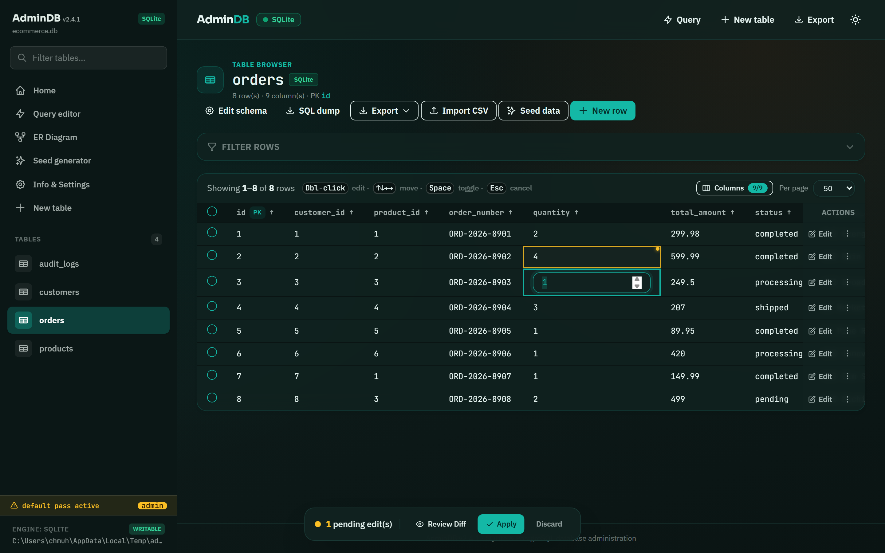
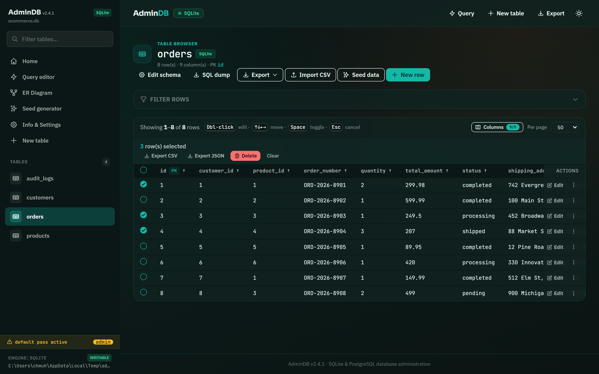
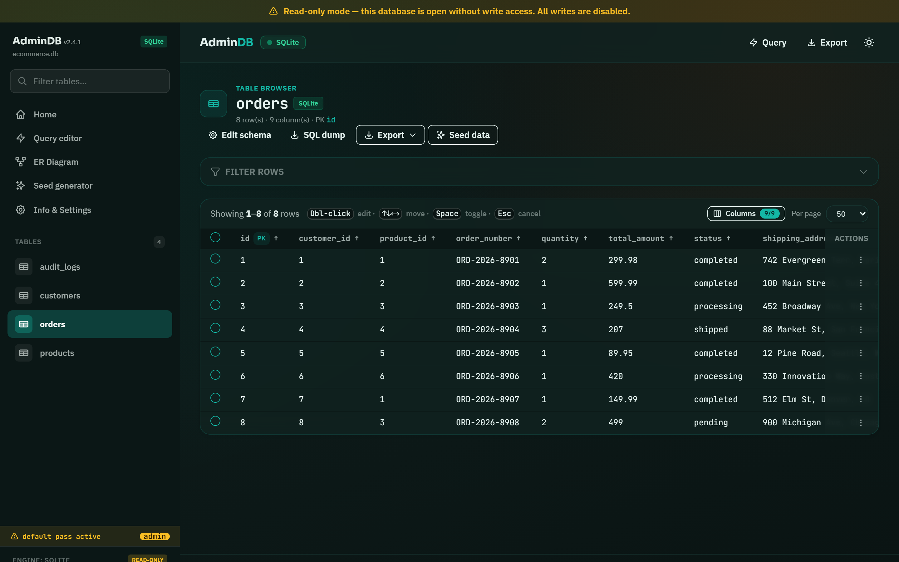
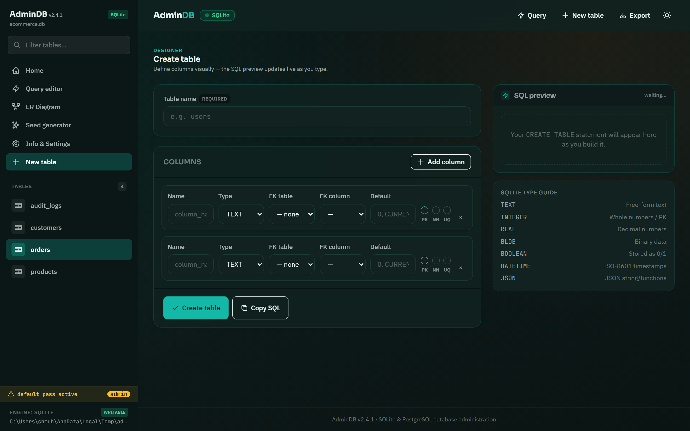
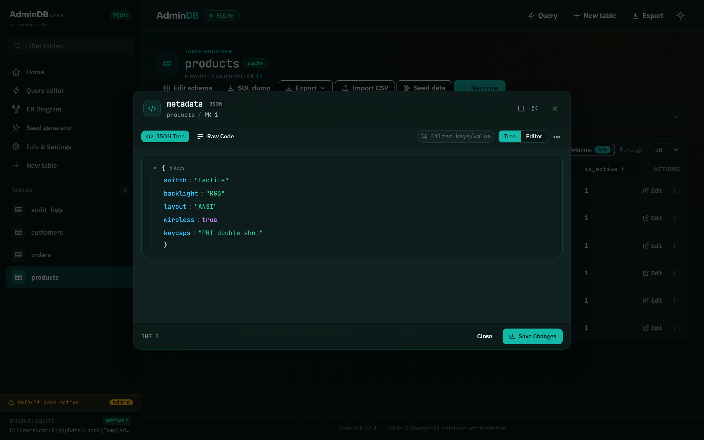
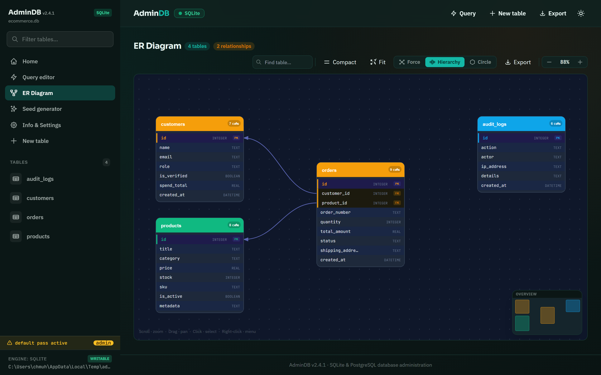
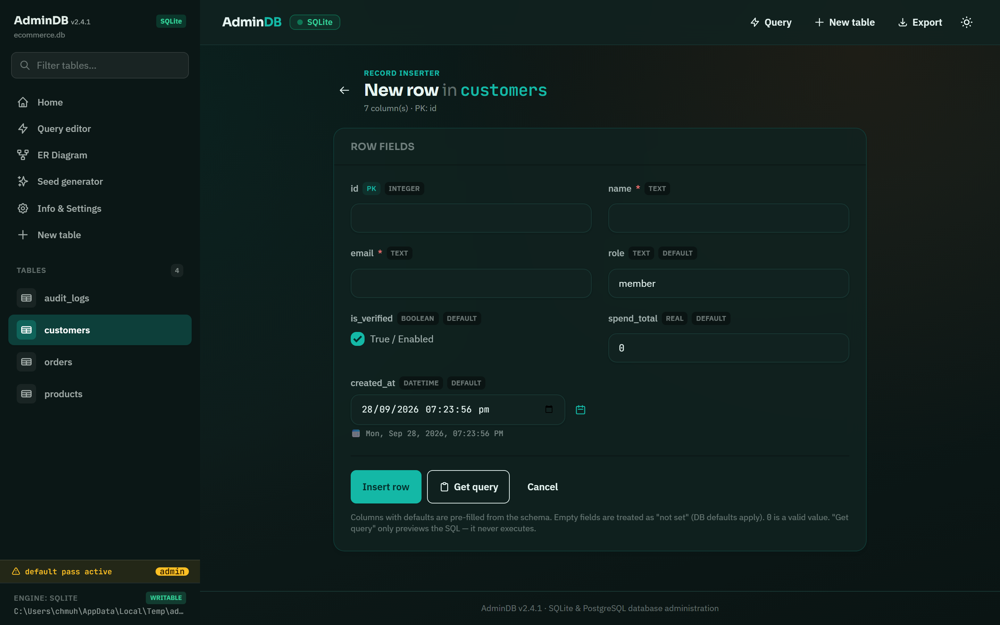
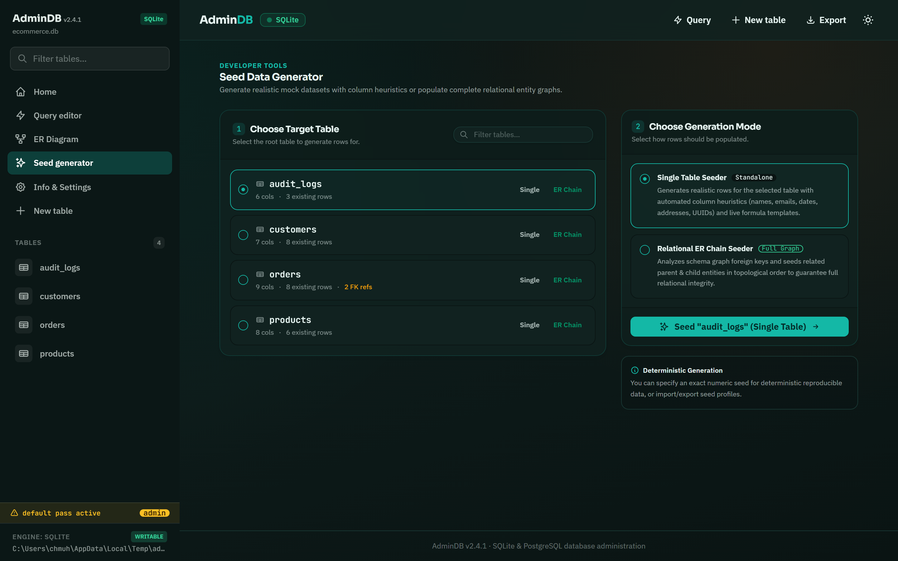
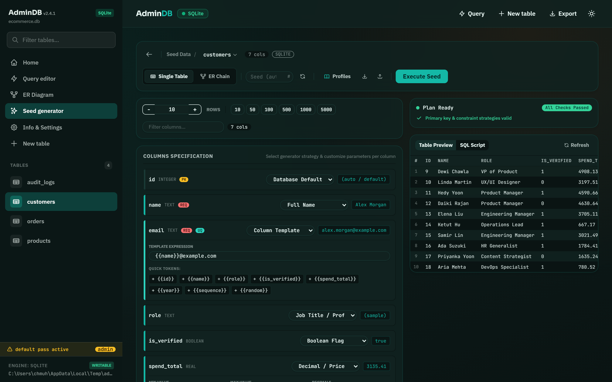
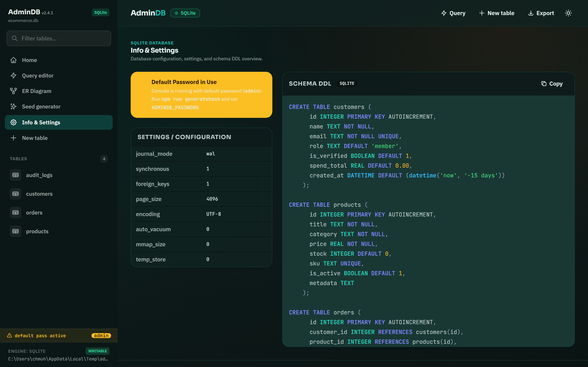

# AdminDB

A modern database management and administration tool designed to make working with databases faster and more intuitive.

## Screenshots

### Home

---

### Database Management

---

### Tables & Data

#### Inline Editing

#### Bulk Actions

#### Read-Only Mode

---

### Schema & Database Design

#### Schema Explorer

#### Database Designer (Blank)

#### Database Designer (Existing Table)

#### Inspector

---

### Entity Relationship Diagram (ERD)

---

### Query Editor

---

### Data Forms

#### Edit Row

#### New Row

---

### Seed Data Generator

#### Table Picker

#### Generator with Preview

---

### Database Info

